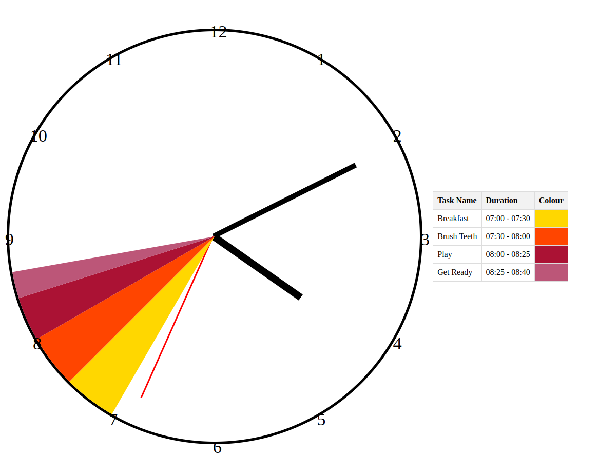

# schedule_clock

## Project Description

This is a web based clock face that shows shaded areas for scheduled tasks. Great for educating kids about time

## Features

- Responsive design that adapts to different screen sizes.
- Dynamic positioning of clock numbers.
- Color-coded task segments indicating scheduled activities.
- Traditional clock hands for hours, minutes, and seconds.

## How it looks like currently


 
## Technologies Used

- HTML
- CSS
- JavaScript

## Setup and Installation

To set up this project locally, follow these steps:

1. Clone the repository:

```bash
$ git clone git@github.com:michnmi/schedule_clock.git
```

2. Navigate to the project directory:

```bash
$ cd responsive-clock
```

3.  Setup python envs for development

```bash
$ sudo apt install python3.10-venv
$ python3 -m venv clock_app
$ source clock_app/bin/activate
$ pip install flask
```

4. Start application

```bash
$ python3 app.py 
 * Serving Flask app 'app'
 * Debug mode: on
WARNING: This is a development server. Do not use it in a production deployment. Use a production WSGI server instead.
 * Running on http://127.0.0.1:5000
Press CTRL+C to quit
 * Restarting with stat
 * Debugger is active!
 * Debugger PIN: 112-544-603
127.0.0.1 - - [11/Jan/2024 22:35:11] "GET / HTTP/1.1" 200 -
127.0.0.1 - - [11/Jan/2024 22:35:11] "GET /static/script.js HTTP/1.1" 200 -
```

5. Visit http://127.0.0.1:5000

